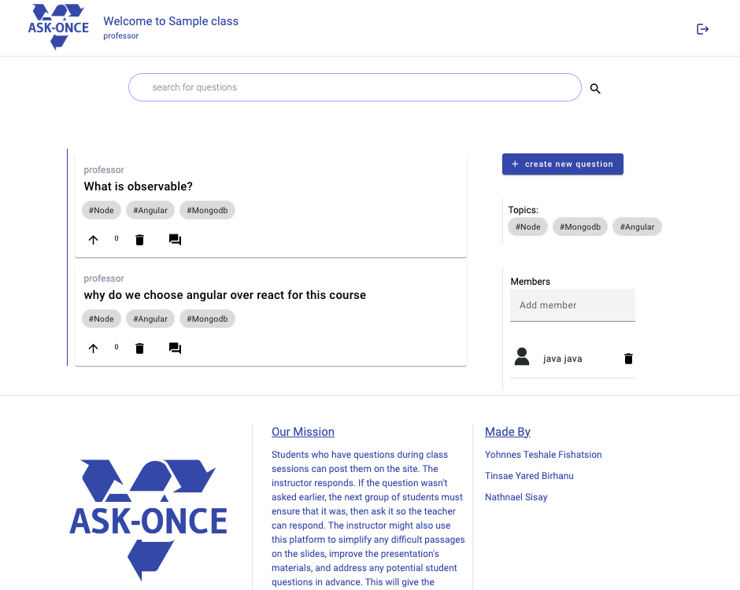

# AskOnce

For many years, most instructors teach the same subject with largely the same course materials. Each batch's students essentially ask the same questions, and each batch's teachers provide identical answers.

Students who have questions during class sessions can post them on the site. The instructor responds. If the question wasn't asked earlier, the next group of students must ensure that it was, then ask it so the teacher can respond.

The instructor might also use this platform to simplify any difficult topics on the slides, improve the presentation's materials, and address any potential student questions in advance. This will give the teacher a fantastic opportunity to make the most of the available time.

## Requirements

- Node version `^18.12.1`
- Updated browser

## Usage

Make sure you have all of them running properly and sequentially for
smooth flow of the application

### Database

- make sure mongodb database active and running

### Back-End

- `cd back-end`
- create `.env` file based on `example.env` and populate with proper values
- `npm install`
- `npm run start`
- server listening - `http://localhost:3000`

### Front-End

- `cd front-end/ask-once`
- `npm install`
- `npm run start`
- UI running - `http://localhost:4200`
